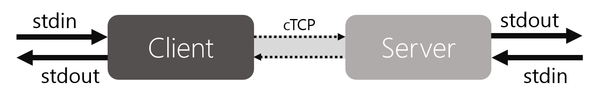
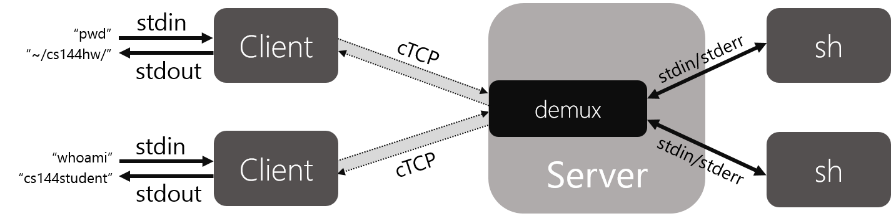
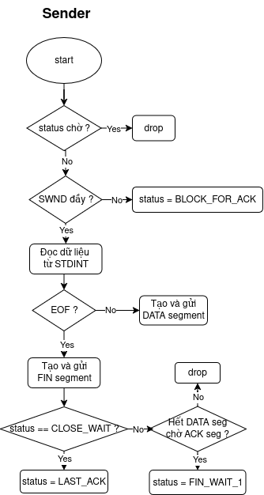
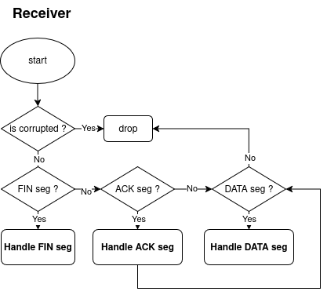
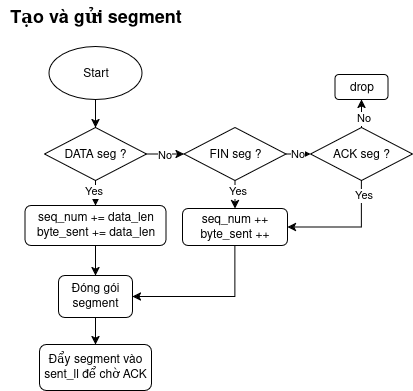
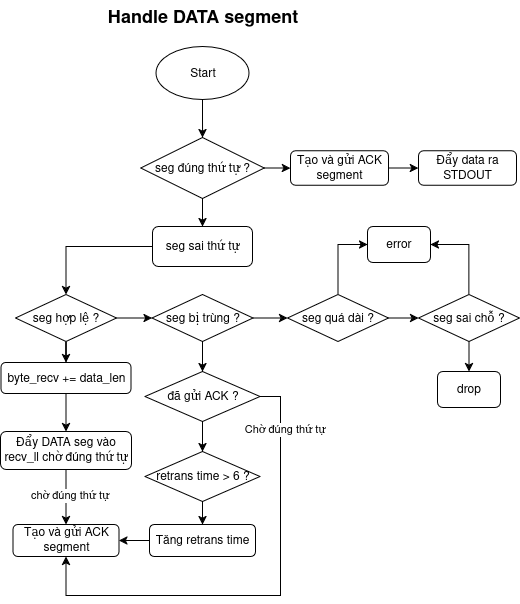
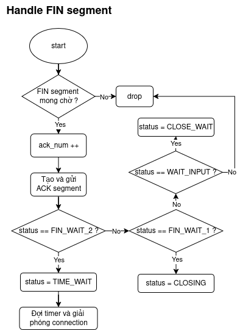
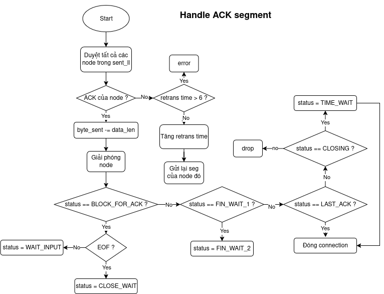
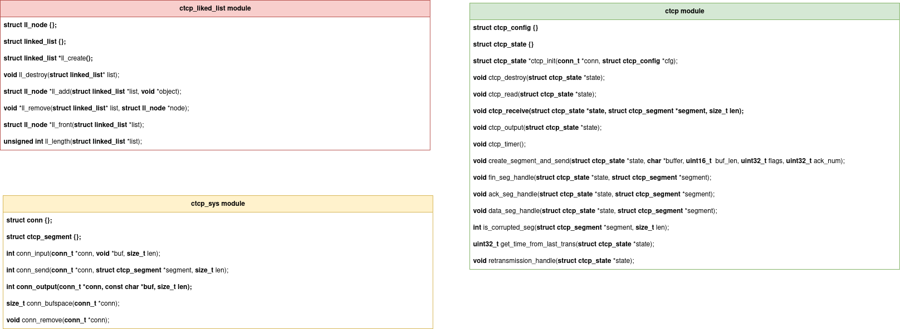

# Implementation: LAB 1, LAB 2

Table of Contents
=================
* 1 [Context](#1-context)
* 2 [Implementation](#2-implementation)
* 3 [Algorithm flowchart](#3-algorithm-flowchart)

## 1. Context
Mục tiêu của 2 bài lab1-2 là để deploy cTCP protocol thông qua 2 cơ chế là **stop-and-wait** và **selective repeat**. Giao thức TCP là giao thức đáng tin cậy nên nó deploy trong 3 quá trình:

- Three-way handshake (Establish connection): Không được deploy trong lab1-2.

- Data transfer: Được deploy trong lab1-2.

- Four-way handshake (Connection teardown): Đươc deploy trong lab1-2.

Sự phức tạp của lab1-2 ở chỗ là phải theo dõi sự thay đổi của **sequence number**, **ack number**, các segment bị delay, miss hoặc duplicate, hơn nữa là phải quản lý các **state machine** như ở sơ đồ dưới đây ạ:

## 2. Implementation
Yêu cầu deploy cụ thể của từng lab sẽ được em trình bày ở dưới đây:

### Lab 1: Stop-and-Wait cTCP
Dưới đây là sơ đồ hệ thống hoạt dộng của cTCP:

Client đọc data từ **STDIN**, phân mảnh data thành các **cTCP segment**, sau đó gửi các **segment** đó tới server. Server đọc những **segment**, bỏ qua những **segment** bị hỏng hoặc trùng lặp, rồi xuất chúng ra **STDOUT**. Kết nối được deploy 2 chiều.

#### Yêu cầu chi tiết:

- Yêu cầu về teardown:
    - Khi gặp EOF, gửi FIN; nhận FIN thì ACK và xuất EOF ra output.
    - Chỉ khi mọi dữ liệu đã truyền đi và nhận được ACK thì mới đóng hẳn kết nối.
    - Hỗ trợ trường hợp ACK và FIN gửi cùng nhau (piggyback).
    - Cần ACK lại FIN nếu chưa nhận được phản hồi (tối đa 5 lần retrans).
- Yêu cầu cho **Stop-and-wait**:
    - Chỉ duy nhất 1 segment dữ liệu ở trạng thái **"in-flight"** mỗi chiều (chưa nhận được ACK cho DATA).
    - Có thể nhận segment dạng piggyback (ACK + DATA).
    - Đảm bảo các segment ở phía nhận không bị lặp.

### Lab 2: Sliding Window cTCP & Multi-Client Server
Ở lab2, yêu cầu thiết kế mở rộng từ cTCP để hỗ trợ đa client kết nối tới server, ngoài ra cần phải hỗ trợ cơ chế **sliding window**, cụ thể là **Selective repeat**.

#### Yêu cầu chi tiết:

- Yêu cầu về buffer và tái sắp xếp segment nhận được:
    - Đảm bảo đầu ra các segment nhận được **in-order**, kể cả các segment thông qua mạng bị **out-of-order**.
    - Nếu các segment đến không đúng thứ tự thì sẽ lưu tam thời trong buffer, không xuất ra output ngay và chỉ xuất ra nếu đúng trình tự gốc.

- Hỗ trợ nhiều client kết nối:
    - Server giữ trạng thái riêng cho mỗi client.
    - Mỗi kết nối có window, buffer, status riêng.

- Truyền nhiều segment đồng thời:
    - Có thể gửi nhiều segment liên tục, miễn là tổng dữ liệu gửi đi <= **window_size**.
    - Hỗ trợ ACK cộng đồn.
    - Retransmission riêng từng segment khi timeout.
    - Có thể tùy chỉnh window_size.

## 3. Algorithm flowchart
Dưới đây là 1 số lưu đồ thuật toán hoạt động của server và client thông qua cTCP:

### Lưu đồ peer đóng vai trò là sender:

### Lưu đồ peer đóng vai trò là Receiver:

### Một số hàm bổ trợ:
#### Hàm tạo và gửi segment:

#### Hàm Xử lý DATA segment nhận được:

#### Hàm xử lý FIN segment nhận được:

#### Hàm xử lý ACK segment nhận được:

#### Các hàm và cấu trúc bổ trợ khác:

