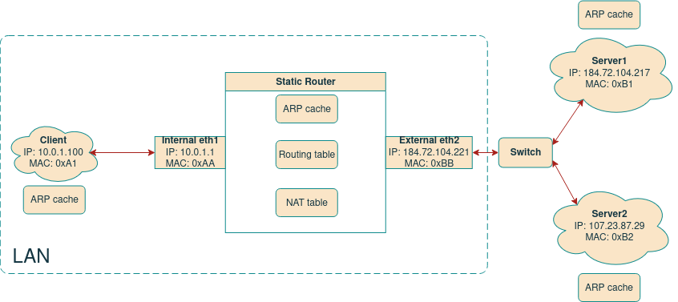
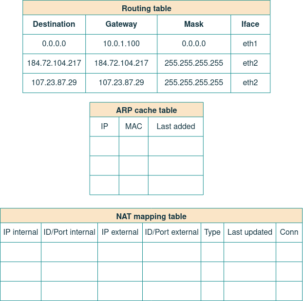
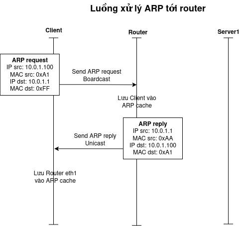
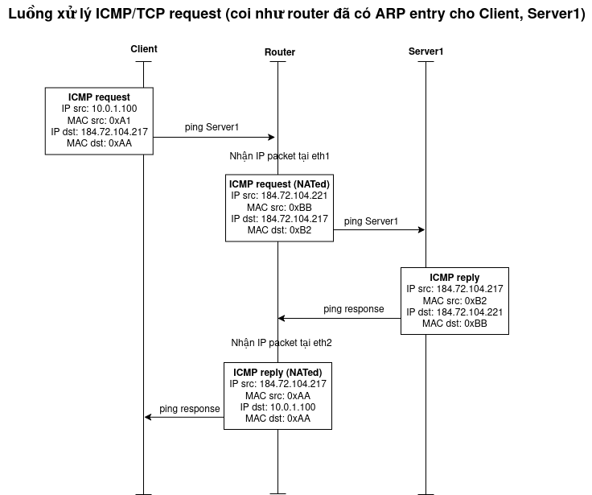
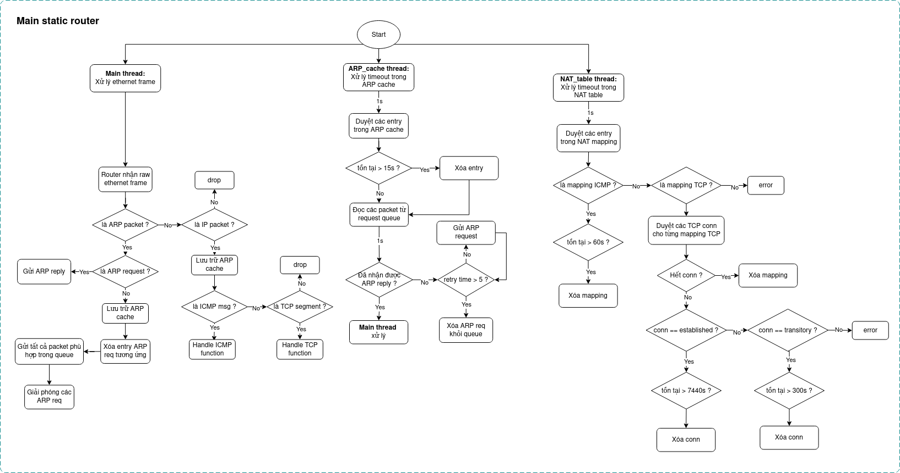
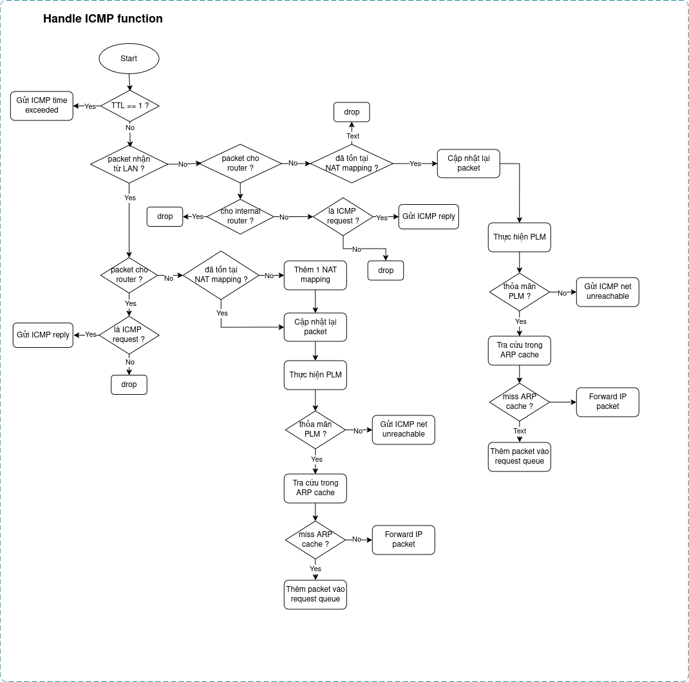
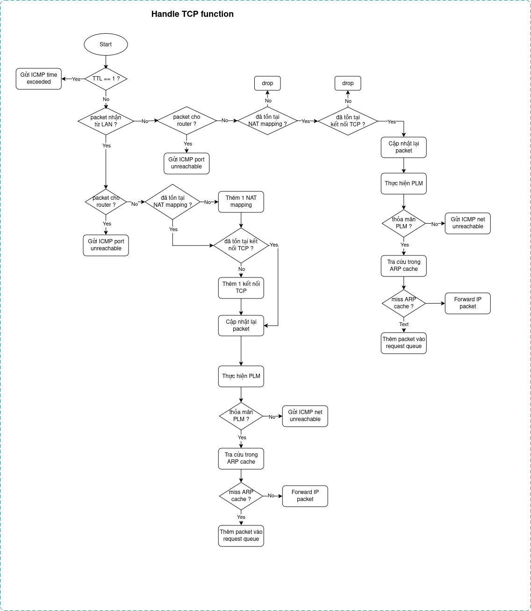

# Implementation: LAB 3, LAB 4

Table of Contents
=================
* 1 [Context](#1-context)
* 2 [Implementation](#2-implementation)
* 3 [System Model](#3-system-model)
* 4 [Sequence Diagram](#4-sequence-diagram)
* 5 [Algorithm flowchart](#5-algorithm-flowchart)

## 1. Context
Mục tiêu của Lab3-4 là xây dựng 1 simple router (SR) được cấu hình với 1 static routing table. SR sẽ nhận những raw eth frame và forwarding chúng tới nơi khác thông qua các NIC của SR.

Những giao thức cần triển khai như: Ethernet, IP, ARP, ICMP, TCP, NAT. Được triển khai cụ thể như sau:
    - Lab 3: Xử lý những eth frame nhận được, thực hiện forwarding theo routing table, xử lý ARP và sinh các thông báo ICMP phù hợp.
    - Lab 4: Mở rộng ở Lab 3 thêm cơ chế NAT có khả năng chuyển đổi (IP, port) cho các gói ICMP và TCP, đảm bảo các kết nối giữa mạng LAN và Internet.

## 2. Implementation
Dưới đây là mục tiêu cụ thể được deploy tổng hợp của cả 2 Lab:
- Xử lý gói Ethernet: Nhận, kiểm tra và gửi các ethernet frame.
- Forwarding IP: Tìm kiếm entry phù hợp nhất trong routing table theo thuật toán LPM để chuyển tiếp gói tin.
- Xử lý ARP: Sinh ra ARP request khi không biết MAC của next hop, sinh ra ARP reply nếu gói tin đến địa chỉ NIC của router, duy trì ARP cache có timeout.
- Sinh ICMP: trả lời ICMP echo reply khi nhận được ping; sinh ra các ICMP error phù hợp (ICMP destination net unreachable, ICMP destination host unreachable, ICMP port unreachable, ICMP time exceeded).
- Quản lý hàng đợi ARP: Các gói tin chờ ARP reply được đẩy vào queue, drop sau 5 lần gửi ARP request không thành công.
- Kiểm tra và cập nhật header: Kiểm tra checksum, decrement TTL, cập nhât lại checksum khi forwarding.
- Dịch địa chỉ và port: Các gói ICMP/TCP từ mạng LAN ra Internet sẽ được đổi IP/port nguồn thành IP/port của NAT và ngược lại.
- Quản lý mapping: Duy trì NAT table và timeout sau thời gian không sử dụng.
- Hỗ trợ Endpoint-Independent Mapping/Filtering: Đảm bảo 1 cặp (IP, port) nội bộ ánh xạ cố định ra 1 port ngoài, bất kể đích là host nào.
- Cấu hình timeout: Các giá trị timeout cho mapping ICMP, TCP established, TCP transitory cấu hình qua CLI.

## 3. System model

Hệ thống gồm 1 mạng LAN (Client) và 2 host ngoài Internet (Server1 và Server 2) được triển khai như trên hình. Các gói tin giữa mạng LAN và Internet được handle và forward thông qua Static Router. SR có các bảng sau:

### Table in Router
Các bảng trong static router em có cấu hình như dưới đây:

Vì đây là static router nên routing table đã được cấu hình trước khi implement, còn ARP cache table và NAT mapping table sẽ được fill in trong quá trình deployment.

## 4. Sequence diagram
Tại SR, nó sẽ phải xử lý những Ethernet frame nhận được, cụ thể đó là những gói tin ARP và IP (ICMP/TCP), dưới đây là 2 luồng hoạt động căn bản xử lý giữa các Host:

Ở trên là 2 luồng tổng quát cho xử lý ARP và ICMP của SR. Về chi tiết, SR có thể xử lý các luồng dưới đây:
- Gói gửi từ mạng LAN tới các NIC của SR => Ok
- Gói gửi từ mạng LAN tới Internet (forward qua SR) => Ok
- Gói gửi từ Internet tới Internet khác (forward qua SR) => Ok
- Gói gửi từ Internet tới external NIC của SR => Ok
- Gói gửi từ Internet tới mạng LAN (forward qua SR) => Ok nếu còn tồn tại NAT mapping entry.
- Gói gửi từ Internet tới internal NIC của SR => drop do bảo mật.

Các luồng ở trên sẽ được cụ thể hóa ở mục **5. Algorithm flowchart**

## 5. Algorithm flowchart
Dưới đây à flowchart của SR được handle xử lý 3 luồng:
- Main thread: Xử lý những gói tin nhận được thông qua raw ethernet frame
- ARP_cache thread: Xử lý timeout trong ARP cache và retry time cho các ARP request trong queue khi chưa nhận được ARP reply.
- NAT_table thread: Xử lý timeout trong NAT table cho ICMP và TCP.

